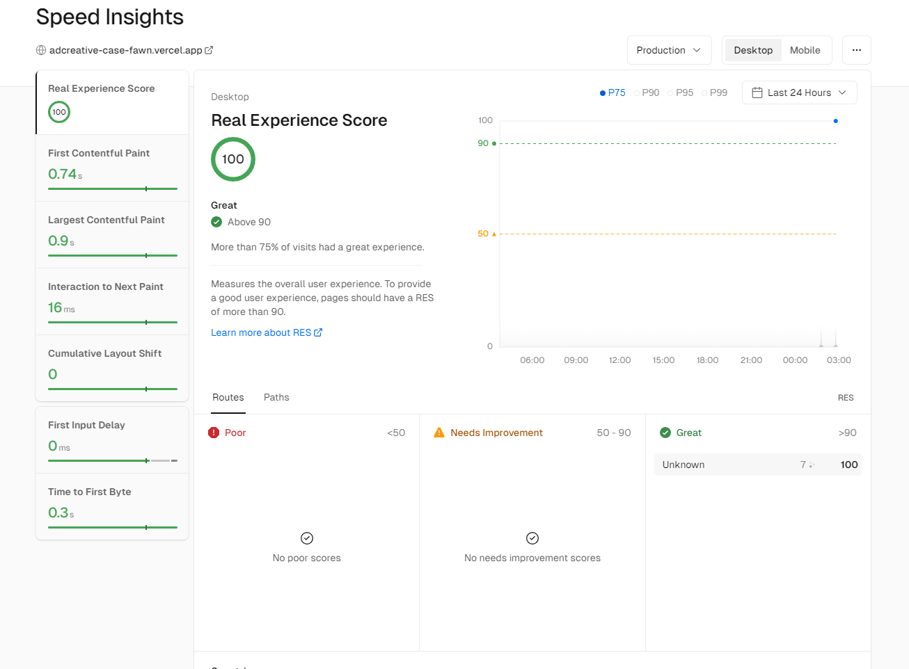

# AdCreative.ai Case

### Dummy API

AdCreative.ai has supplied a dummy API to be able to fetch and populate the case.

`https://rickandmortyapi.com/api/`

```http
GET https:///rickandmortyapi.com/apicharacter?name=${query}
```

### Features

- React & Typescript
- Multi-Select
- Input Query
- Debouncing to handle unnecessary API calls.
- Keyboard Navigation
- Loading, Error States

### Libraries:

This is the list of the NPM packages that has been used in this project.

1. [React](https://www.npmjs.com/package/react)
2. [React-Redux](https://www.npmjs.com/package/react-redux)
3. [Redux-Toolkit](https://www.npmjs.com/package/@reduxjs/toolkit)
4. [RTK-Query](https://www.npmjs.com/package/@reduxjs/toolkit)
5. [use-debounce](https://www.npmjs.com/package/use-debounce)

---

### Vercel's Speed Insights



### Contact me for business inquiries

- [More about me can be found in my LinkedIn Profile](https://linkedin.com/in/ayberkenis)
- [You can directly reach me from my email address](mailto:ayberkenis@gmail.com)

#### It's also responsive, btw.

##### Umm, I've also inspected Adcreative's Home page too learn about their design code.
